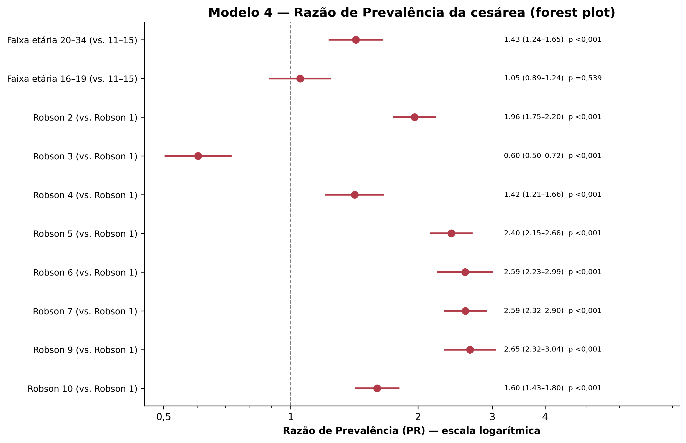
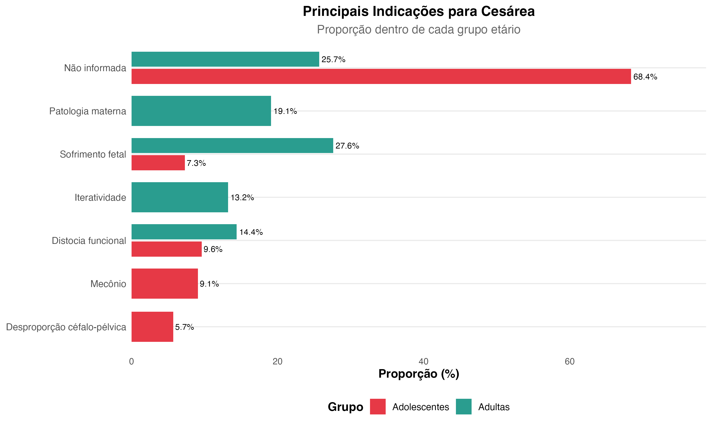
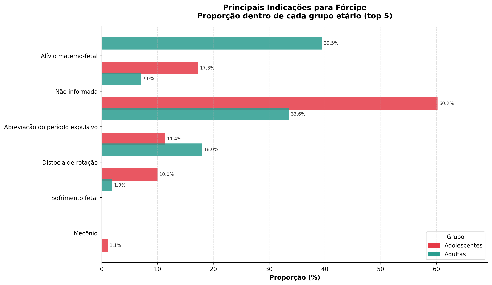
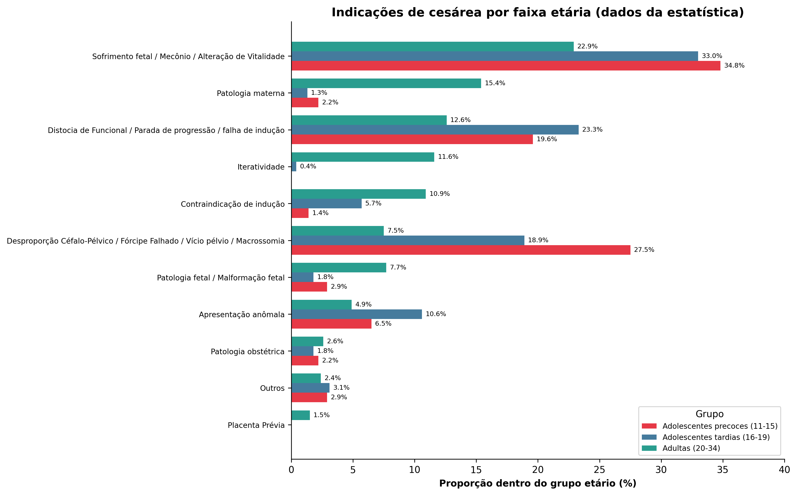

# Revisão da dissertação — o que atualizar nos Métodos, Resultados e Discussão

**Versão revisada:** `manuscript/Dissertacao16_06_2026.pdf` (16/06/2026)
**Atualizado:** 17/06/2026
**Motivo:** alinhar a dissertação à migração **Odds Ratio (OR) → Razão de Prevalência**
decidida pelo orientador (ver `COMPARACAO_OR_vs_PR.md`). A análise multivariada já foi
reprocessada em PR (Poisson robusto; Zou, 2004); **falta refletir isso no texto da
dissertação.**

> **Resumo em uma frase:** a direção e a significância de todos os achados continuam
> iguais — só muda a **medida** (de OR para PR) e, portanto, a **magnitude** e a
> **forma de descrever** os efeitos. O achado central (idade adulta = fator de risco
> independente para cesárea) permanece intacto.

> ✅ **Estado no manuscrito 16/06 (conferido):**
> - **Métodos** — já incluem o parágrafo do Poisson com variância robusta para a razão
>   de prevalência (citando Zou, 10.1002/sim.7059). **Porém** o texto ainda menciona
>   também o Odds Ratio; ver §1 (precisa decidir entre as duas medidas e padronizar a
>   sigla — você usou **"RP"** no manuscrito e o código/CSVs usam **"PR"**; escolha uma).
> - **Resultados §5.5** — **ainda em OR** (Tabela 10, Figura 7 e texto). Você mesma
>   deixou o comentário *"Retomar isso aqui para alterar OR"* (LA19). As mudanças da §2
>   deste documento continuam **pendentes**.
> - **Seção 5.4** — já usa a tabulação da estatística (365/3.228 cesáreas). Há uma
>   **incoerência de tamanho amostral** com a Tabela 4 (433/3.313): ver §8.7 e a
>   **Seção 0 do `RELATORIO_REVISAO_NUMERICA`**.

Fonte canônica dos números (oficial): arquivo da estatística `modelagem_de Robson.xlsx`,
exportado para `results/tabelas_dissertacao/tab10_modelo4_PR.csv` (modelo principal) e
`tab10c_modelo4_interacao_PR.csv` (modelo de interação). Estes substituem as estimativas
anteriores em R.

> **Nota de sigla:** neste documento uso **PR** (como no código). No manuscrito você
> escreveu **RP** (razão de prevalência) — em português, "RP" é a sigla mais natural.
> Tanto faz, desde que **a mesma sigla** apareça em Métodos, Tabela 10 e Figura 7.

> 📖 **Lê:** se quiser entender o que cada teste estatístico faz antes de mexer no
> texto, comece pela **Seção 7 — "Para a Lê: os testes estatísticos em linguagem
> simples"** (no fim deste documento).

---

## 1. Métodos (Seção 4 — Análise estatística)

**Trecho atual (parágrafo da análise multivariada):**
> "A fim de identificar os fatores independentemente associados à ocorrência de
> nascimento por cesariana, foram construídos e avaliados quatro modelos de
> **regressão logística múltipla**. (...) O Modelo 4 (Sugestão 4) ajustou
> simultaneamente a faixa etária, síndromes hipertensivas obstétricas e os grupos
> de Robson reduzidos, tendo como categoria de referência o Grupo 1."

> ⚠️ **Atualização (16/06):** o parágrafo do Poisson/RP **já foi inserido** nos Métodos
> ("…análise de Poisson, com variância robusta e função log-linear, para estimar as
> razões de prevalência (RP)… 10.1002/sim.7059"). **Ação pendente:** o mesmo parágrafo
> ainda menciona estimar **Odds Ratios (OR)** — como a medida adotada passou a ser a RP,
> **remova (ou reposicione como histórico) a menção ao OR** para não dar a impressão de
> que as duas medidas foram reportadas em paralelo. A redação sugerida abaixo serve de
> referência para o texto final.

**O que mudar:** deixar claro que a **medida de efeito reportada é a Razão de
Prevalência**, não o Odds Ratio, e por quê. Sugestão de redação (consolidando o que já
está no texto):

> "Como a cesárea é um desfecho de **alta prevalência** nesta coorte (~56%), o Odds
> Ratio superestimaria a magnitude das associações. Por isso, a medida de efeito
> reportada é a **Razão de Prevalência (RP)**, estimada por **regressão de Poisson com
> variância robusta e função log-linear** (*modified Poisson*; Zou, 2004), na qual o
> coeficiente exponenciado estima diretamente a RP. O Modelo 4 ajustou simultaneamente
> os **grupos de Robson reduzidos** (referência: Robson 1) e a **faixa etária em três
> categorias** (referência: 11–15 anos). A qualidade do ajuste foi de 0,463
> (Qui-quadrado de Pearson por grau de liberdade)."

> ⚠️ **Mudanças estruturais nos valores oficiais da estatística (arquivo
> `modelagem_de Robson.xlsx`), a refletir no texto:**
> 1. **Faixa etária em 3 categorias** (11–15 ref., 16–19, 20–34) — não mais "adulta vs.
>    adolescente". Isso muda a leitura do achado central (ver §2.3 e §3).
> 2. **O Modelo 4 oficial não inclui a DHEG** — só Robson reduzido + faixa etária. O
>    texto atual dos Métodos descreve o Modelo 4 como "faixa + DHEG + Robson"; **é
>    preciso reconciliar**: ou se acrescenta a DHEG ao modelo da estatística, ou se
>    remove a DHEG da descrição. Como está, há divergência entre a descrição e a tabela.
> 3. A RP foi estimada **no SPSS** (GENLIN, Poisson com covariância robusta), não no R.
>    Ajustar a frase para não dizer que foi no R.

**Referência a incluir na bibliografia:** Zou G. *A modified Poisson regression
approach to prospective studies with binary data.* Am J Epidemiol. 2004;159(7):702–706.
(DOI 10.1002/sim.7059 corresponde ao artigo de extensão de Zou & Donner, 2013 — conferir
qual referência a estatística pretende citar.)

---

## 2. Resultados (Seção 5.5 — Fatores associados à cesárea)

### 2.1 Tabela 10 — valores oficiais de PR (estatística, `modelagem_de Robson.xlsx`)

Substituir a coluna **OR** pela **PR (RP)** com os valores oficiais abaixo. **Modelo:
Robson reduzido + faixa etária (3 categorias).** Referências: Robson 1 e faixa 11–15.

| Variável | PR | IC 95% | p |
|---|---|---|---|
| Faixa etária 20–34 (vs. 11–15) | **1,43** | 1,24 – 1,65 | < 0,001 |
| Faixa etária 16–19 (vs. 11–15) | **1,05** | 0,89 – 1,24 | 0,539 (n.s.) |
| Robson 2 (vs. Robson 1) | **1,96** | 1,75 – 2,20 | < 0,001 |
| Robson 3 (vs. Robson 1) | **0,60** | 0,50 – 0,72 | < 0,001 |
| Robson 4 (vs. Robson 1) | **1,42** | 1,21 – 1,66 | < 0,001 |
| Robson 5 (vs. Robson 1) | **2,40** | 2,15 – 2,68 | < 0,001 |
| Robson 6 (vs. Robson 1) | **2,59** | 2,23 – 2,99 | < 0,001 |
| Robson 7 (vs. Robson 1) | **2,59** | 2,32 – 2,90 | < 0,001 |
| Robson 9 (vs. Robson 1) | **2,65** | 2,32 – 3,04 | < 0,001 |
| Robson 10 (vs. Robson 1) | **1,60** | 1,43 – 1,80 | < 0,001 |

CSV pronto: `results/tabelas_dissertacao/tab10_modelo4_PR.csv`.

**Legenda/rodapé da Tabela 10:**
- Título: "Modelo 4 de regressão logística múltipla..." → "**Modelo 4 — fatores
  associados ao nascimento por cesariana (Razão de Prevalência)**".
- Rodapé: "**RP = razão de prevalência, estimada por regressão de Poisson com variância
  robusta e função log-linear (Zou, 2004); IC 95% = intervalo de confiança de 95% de
  Wald.** Referências: Robson 1 e faixa etária 11–15 anos. Qualidade do ajuste = 0,463
  (Qui-quadrado de Pearson por grau de liberdade)."

> ⚠️ **Note as diferenças em relação à versão anterior deste documento:** (i) a faixa
> etária aparece em **3 categorias** (a tardia 16–19 **não** difere da precoce 11–15:
> PR 1,05; p = 0,539); (ii) **não há linha de DHEG** (ver §1); (iii) os PR de Robson
> mudaram um pouco em relação à minha estimativa em R (ex.: Robson 5 2,40 vs. 2,38) —
> **valem os da estatística**.

### 2.2 Figura 7 — forest plot (regenerado com os valores oficiais)

- **Legenda:** "Figura 7 – Forest plot das **Razões de Prevalência (PR)** do Modelo 4.
  Eixo X em escala logarítmica. Colunas à direita: PR (IC 95%) e p-valor. RP estimada
  por regressão de Poisson com variância robusta (Zou, 2004); referências: Robson 1 e
  faixa 11–15."
- **Arquivo:** `results/figures/fig_obj5_forest_plot_modelo4.png` — **regenerado com os
  valores da estatística** (10 linhas: 2 de faixa + 8 de Robson).

### 2.3 Texto narrativo da Seção 5.5 — reescrever as leituras

Reescrever em **prevalência**, já com os valores oficiais e a faixa em 3 categorias:

| O que dizer | Redação sugerida |
|---|---|
| Achado central (idade) | "Após ajuste pelos grupos de Robson, as **adultas (20–34)** apresentaram **cerca de 43% mais prevalência** de cesárea que as adolescentes precoces (11–15) — **PR = 1,43 (IC 95%: 1,24–1,65; p < 0,001)**. Já as **adolescentes tardias (16–19) não diferiram** das precoces (PR = 1,05; IC 95%: 0,89–1,24; p = 0,539)." |
| Grupos de maior magnitude | "Os grupos de apresentação anômala (6, 7 e 9) e o Grupo 5 tiveram a maior prevalência relativa de cesárea — cerca de **2,4 a 2,7 vezes** a do Grupo 1 (Robson 9: PR = 2,65; Robson 7: 2,59; Robson 6: 2,59; Robson 5: 2,40)." |
| Grupo 3 (protetor) | "O Grupo 3 (multíparas em trabalho espontâneo) manteve-se protetor: **PR = 0,60 (IC 95%: 0,50–0,72; p < 0,001)** — ~40% menos prevalência de cesárea que o Grupo 1." |
| Grupos 2, 4 e 10 | "Robson 2: PR = 1,96; Robson 4: 1,42; Robson 10: 1,60 (todos p < 0,001)." |

> ⚠️ **Remover a frase "dobra a chance" da DHEG** e qualquer leitura em "chance/OR".
> Como o Modelo 4 oficial **não inclui a DHEG**, a frase sobre DHEG na §5.5 precisa
> ser **removida** ou movida para a análise bivariada — a menos que vocês decidam
> reincluir a DHEG no modelo (ver §1).

> **Por que a magnitude é menor que a do OR (ex.: Robson 5 ~2,4 vs. OR 12,8):** o OR só
> aproxima o risco relativo quando o desfecho é raro; com cesárea a 56%, ele inflava os
> efeitos. A PR é a leitura correta ("2,4× a prevalência") e com ICs estreitos. **É um
> ponto forte para a banca**, não fragilidade.

### 2.4 Sub-modelo de interação (final da Seção 5.5) — valores oficiais de PR

A estatística também enviou o **modelo de interação faixa × Robson em PR** (referência:
**Adolescentes do Robson 1**). Substituir os OR antigos (0,38 / 0,21 / 1,95) por estes:

| Termo | PR | IC 95% | p |
|---|---|---|---|
| Adultas — Robson 1 | 1,29 | 1,06 – 1,56 | 0,010 |
| Adolescentes — Robson 2 | 1,94 | 1,59 – 2,36 | < 0,001 |
| Adultas — Robson 2 | 2,65 | 2,36 – 2,99 | < 0,001 |
| Adolescentes — Robson 3 | 0,98 | 0,72 – 1,35 | 0,908 (n.s.) |
| Adultas — Robson 3 | 0,74 | 0,61 – 0,90 | 0,002 |
| Adultas — Robson 4 | 1,92 | 1,64 – 2,24 | < 0,001 |
| Adultas — Robson 5 | 3,25 | 2,90 – 3,63 | < 0,001 |
| Adolescentes — Robson 6 | 3,68 | 3,30 – 4,11 | < 0,001 |
| Adultas — Robson 6 | 3,42 | 2,94 – 3,97 | < 0,001 |
| Adolescentes — Robson 7 | 3,51 | 3,05 – 4,05 | < 0,001 |
| Adultas — Robson 7 | 3,41 | 3,04 – 3,83 | < 0,001 |
| Adolescentes — Robson 9 | 3,68 | 3,30 – 4,11 | < 0,001 |
| Adultas — Robson 9 | 3,38 | 2,93 – 3,91 | < 0,001 |
| Adolescentes — Robson 10 | 0,96 | 0,72 – 1,27 | 0,778 (n.s.) |
| Adultas — Robson 10 | 2,28 | 2,02 – 2,57 | < 0,001 |

CSV pronto: `results/tabelas_dissertacao/tab10c_modelo4_interacao_PR.csv`.

> ⚠️ **Cautela (separação quase-perfeita):** os valores de **Adolescentes nos Robson 6,
> 7 e 9** repousam sobre **pouquíssimos casos** (n = 1–5, quase todos cesárea) — daí os
> PR idênticos (3,68) nos grupos 6 e 9. Interpretar apenas qualitativamente e registrar
> a limitação. Remover também a **nota de edição solta** "*a tabela de interação da aba
> robson interação*" do texto final.

---

## 3. Discussão (Seção 6.1)

**Trecho atual:**
> "(...) a faixa etária adulta atua como fator de risco independente para a ocorrência
> de cesárea, apresentando uma **chance 78% maior** de evolução para cesariana em
> comparação com o grupo de gestantes adolescentes."

**Trocar para:**
> "(...) a faixa etária adulta atua como fator de risco independente para a ocorrência
> de cesárea, apresentando **cerca de 43% mais prevalência** de cesárea (PR = 1,43;
> IC 95%: 1,24–1,65) em comparação com as adolescentes precoces (11–15), mesmo após
> ajuste pelo perfil obstétrico (grupos de Robson). As adolescentes tardias (16–19),
> por sua vez, não diferiram das precoces (PR = 1,05; p = 0,539)."

**Demais pontos da Discussão:**
- O restante da Seção 6.1 discute **pontos percentuais de taxa de cesárea** por grupo
  de Robson (ex.: "10 pontos percentuais", "47,2% → 71,8%", "35,1 pontos percentuais").
  **Esses números não dependem de OR/PR** e **permanecem inalterados**.
- Onde o texto interpreta o Grupo 5 como "principal determinante", continua válido — em
  PR ele está entre os de maior efeito (PR = 2,40), junto de 6/7/9. Só evitar
  linguagem de "chance" e dizer "prevalência".
- ⚠️ Se a Discussão mencionar a **DHEG** como fator do Modelo 4, reveja: o modelo
  oficial atual **não inclui** a DHEG (ver §1). A DHEG continua válida na análise
  bivariada/descritiva (§6.2), mas não como coeficiente ajustado do Modelo 4.
- **Sugestão (opcional, mas valoriza o trabalho):** acrescentar 1–2 frases na Discussão
  ou nas Limitações explicando a **escolha metodológica do PR** (desfecho de alta
  prevalência → OR enviesado → modified Poisson de Zou). Isso antecipa pergunta de banca.
- As Seções 6.2 e 6.3 (comorbidades, fórcipe) **não usam OR** e não precisam de mudança.

---

## 4. Listas de figuras e tabelas (páginas iniciais)

- "Figura 7 – Forest plot dos **Odds Ratios** do Modelo 4..." → "**das Razões de
  Prevalência (PR)**".
- "Tabela 10 – Modelo 4 de **regressão logística múltipla** para nascimento por
  cesariana." → "Tabela 10 – **Modelo 4 — fatores associados ao nascimento por
  cesariana (Razão de Prevalência)**."

O **Resumo/Abstract** não citam OR (falam em taxas de cesárea 32% vs 62%), então **não
precisam de alteração**.

---

## 5. Checklist rápido para aplicar no documento

- [ ] Métodos §4: inserir parágrafo do PR (Poisson robusto, Zou 2004) + ref. bibliográfica.
- [ ] Métodos §4: esclarecer que o Modelo 4 foi estimado no R (não SPSS).
- [ ] Tabela 10: substituir coluna OR → PR (10 linhas) + IC novos + título + rodapé.
- [ ] Figura 7: trocar legenda (OR → PR) e confirmar a imagem nova.
- [ ] Texto §5.5: reescrever as leituras (78%→43%; faixa em 3 categorias; remover "dobra a chance" e a DHEG do Modelo 4; etc.).
- [ ] §5.5 interação: decidir migrar para PR **ou** declarar OR; remover a nota solta.
- [ ] Discussão §6.1: "chance 78% maior" → "~43% mais prevalência (PR = 1,43; adultas vs. precoces 11–15)".
- [ ] Listas de figuras/tabelas: atualizar legendas da Tabela 10 e Figura 7.
- [ ] (Opcional) Discussão/Limitações: justificar a escolha do PR.

---

## 6. Observação sobre artefatos gerados (fora do texto)

O painel `index.html` e os exports `RELATORIO_REVISAO_NUMERICA.{html,docx,pdf}` são
**gerados** a partir de `index.qmd` e do `.md` correspondente. O `.qmd` e os `.md`
já estão em PR; os exports renderizados podem estar defasados. Para sincronizá-los:
`quarto render index.qmd` e re-exportar o relatório de revisão. Não afeta a dissertação,
mas convém regenerar antes de compartilhar o painel.

---

## 7. Para a Lê — os testes estatísticos em linguagem simples

Esta seção explica, sem jargão, **o que cada teste faz, por que foi usado e como ler o
resultado**. A ideia é que você consiga defender cada escolha na banca com suas próprias
palavras.

### 7.1 Duas perguntas que toda estatística responde

Quase tudo na dissertação gira em torno de duas perguntas:

1. **"Os grupos são diferentes de verdade, ou foi por acaso?"** → quem responde isso é
   o **p-valor** (testes de comparação).
2. **"Se há diferença, de que tamanho ela é?"** → quem responde isso é a **medida de
   efeito** (no nosso caso, a **Razão de Prevalência**).

Você precisa das duas: uma diferença pode ser "real" (p pequeno) mas minúscula, ou
grande mas incerta. Por isso sempre reportamos as duas coisas juntas.

### 7.2 O p-valor e a "significância de 5%"

O **p-valor** é a probabilidade de você observar uma diferença tão grande quanto a sua
**se, na verdade, não houvesse diferença nenhuma** entre os grupos. É um número entre 0 e 1.

- **p pequeno (< 0,05)** = é improvável que o resultado seja só acaso → dizemos que a
  diferença é **estatisticamente significativa**.
- **p grande (≥ 0,05)** = não dá para descartar o acaso → "não significativo".

O corte de **5% (0,05)** é a convenção que adotamos. Quando você lê "p < 0,001", quer
dizer que a chance de ser acaso é menor que 1 em 1.000 — ou seja, um resultado muito
sólido. **Importante:** p < 0,05 **não** quer dizer que o efeito é grande, só que ele
provavelmente existe.

### 7.3 Qui-quadrado de Pearson e teste exato de Fisher (comparar proporções)

Usados quando as duas variáveis são **categorias** (ex.: faixa etária × tipo de parto).
A pergunta: *"a proporção de cesárea é diferente entre adolescentes e adultas?"*

- **Qui-quadrado de Pearson:** compara o que você **observou** com o que seria
  **esperado se não houvesse associação**. Se a diferença observado-vs-esperado for
  grande, o p fica pequeno e concluímos que há associação.
- **Teste exato de Fisher:** faz o mesmo, mas é usado quando alguma **casela tem poucos
  casos** (regra prática: contagens esperadas < 5). Nesses casos o qui-quadrado fica
  pouco confiável e o Fisher é mais correto. Por isso o texto diz "qui-quadrado **ou**
  Fisher, conforme apropriado".

**Como ler:** "associação significativa entre faixa etária e via de parto (p < 0,001)"
= a distribuição de partos realmente difere entre os grupos etários.

### 7.4 Teste de Kolmogorov-Smirnov (a variável é "normal"?)

Para variáveis **numéricas** (ex.: idade, número de consultas, idade gestacional),
antes de resumir os dados precisamos saber se eles seguem a **curva normal** (o "sino"
simétrico). O **Kolmogorov-Smirnov** testa exatamente isso.

- Se **é normal** → resumimos com **média ± desvio-padrão**.
- Se **não é normal** → resumimos com **mediana e intervalo interquartil (IIQ)**, que
  são mais honestos quando há valores extremos.

É só um teste de "qual resumo usar", não um achado clínico em si.

### 7.5 Comparar um número entre 3 grupos: os testes da Seção 5.1.6 (Número de consultas)

A análise do **número de consultas de pré-natal** por faixa etária (Seção 5.1.6) usa um
conjunto específico de testes, porque a variável é **numérica**, comparada entre **três
grupos** (precoces, tardias e adultas) e **não segue a curva normal**. Esta é a
"caixa de ferramentas não-paramétrica":

**a) Shapiro-Wilk — a variável é normal?**
Mesmo papel do Kolmogorov-Smirnov (Seção 7.4): testa se os dados seguem o "sino". Aqui
deu **p < 0,001 nos três grupos**, ou seja, **não são normais**. Por isso usamos a
mediana (não a média) e testes não-paramétricos. (Os dois testes de normalidade são
intercambiáveis; o Shapiro-Wilk costuma ser preferido em amostras menores.)

**b) Kruskal-Wallis — há diferença entre os 3 grupos?**
É a versão não-paramétrica da comparação de médias entre vários grupos. Em vez de
comparar médias, ele compara a **posição (os "postos") das observações** entre os
grupos. Responde: *"o número de consultas difere entre pelo menos um par de faixas
etárias?"* Resultado: **H = 18,52; gl = 2; p < 0,001** → sim, existe diferença global.
É o "irmão" do qui-quadrado, mas para variáveis numéricas em vez de categorias.

**c) ε² (epsilon-quadrado) — a diferença é grande ou pequena?**
O Kruskal-Wallis só diz que **existe** diferença, não o **tamanho** dela. O ε² mede isso:
vai de 0 a 1. Aqui **ε² = 0,003**, um valor **praticamente nulo** — ou seja, a diferença
é real (não é acaso), mas tão pequena que tem pouca relevância prática. **Esse contraste
é importante de mencionar:** com amostra grande, até diferenças minúsculas viram
"significativas"; o tamanho de efeito é que mostra se importam.

**d) Post-hoc de Dunn com correção de Holm — entre QUAIS grupos está a diferença?**
O Kruskal-Wallis diz que há diferença em algum lugar, mas não onde. O **teste de Dunn**
compara os grupos **dois a dois** (precoces vs. tardias, precoces vs. adultas, tardias
vs. adultas) para localizar a diferença. Como fazer várias comparações ao mesmo tempo
aumenta a chance de um "falso positivo", aplica-se a **correção de Holm**, que torna o
critério mais rígido para compensar. Resultado: precoces fizeram menos consultas que
adultas (p < 0,001) e que tardias (p = 0,045); entre tardias e adultas não houve
diferença (p = 0,131).

> ⚠️ **Ressalva que precisa aparecer no texto:** essa variável tem **muitos dados
> ausentes e de forma desigual** — faltou em ~61% das adolescentes contra ~11% das
> adultas. Então a comparação se apoia em poucas adolescentes (210 precoces, 322
> tardias) e pode estar enviesada. Reporte sempre o **n válido e o % de ausência por
> grupo** e trate o achado com cautela — ainda mais porque o efeito é desprezível
> (ε² = 0,003). Texto pronto está em `results/RESUMO_consultas_faixa_etaria.md`.

### 7.6 A Classificação de Robson (organizar antes de comparar)

Não é um teste estatístico, e sim uma **forma de agrupar** as gestantes em 10 grupos
segundo características objetivas (paridade, cesárea prévia, início do parto,
apresentação, número de fetos, idade gestacional). É o padrão da OMS.

**Por que importa:** comparar a taxa de cesárea "crua" entre adolescentes e adultas
seria injusto, porque as adultas têm mais cesárea prévia, mais gravidez múltipla, etc.
Ao comparar **dentro de cada grupo de Robson**, você compara situações clínicas
parecidas — é como comparar "laranja com laranja". Foi isso que permitiu mostrar que a
diferença por idade não é só efeito da composição dos grupos.

### 7.7 A medida de efeito: Razão de Prevalência (PR) — a estrela da revisão

Depois de saber que **existe** diferença (p-valor), queremos saber o **tamanho** dela.
A **Razão de Prevalência (PR)** faz isso de forma direta:

> **PR = prevalência de cesárea no grupo exposto ÷ prevalência no grupo de referência.**

Leitura por exemplos:

- **PR = 1,43** (adultas 20–34 vs. precoces 11–15) → as adultas têm **43% mais** cesárea.
- **PR = 2,40** (Robson 5) → esse grupo tem **2,4 vezes** a prevalência de cesárea do
  grupo de referência.
- **PR = 0,60** (Robson 3) → esse grupo tem **40% menos** cesárea (PR abaixo de 1 =
  fator de proteção).
- **PR = 1** → nenhuma diferença.

A PR vem acompanhada de um **intervalo de confiança de 95% (IC 95%)** — a faixa de
valores plausíveis. Ex.: PR 1,43 (IC 1,24–1,65) significa "o valor mais provável é 1,43,
e quase certamente está entre 1,24 e 1,65". **Se o IC não cruza o 1, o efeito é
significativo.**

### 7.8 Por que trocamos o Odds Ratio (OR) pela PR

O **Odds Ratio (OR)** é uma "razão de chances". Ele é uma boa aproximação do risco
**só quando o desfecho é raro** (< ~10% dos casos). A cesárea aqui acontece em **~56%**
das gestantes — está longe de ser rara. Nesse cenário, o **OR exagera** o tamanho do
efeito.

Foi exatamente o que aconteceu: o OR dizia que o Robson 5 multiplicava o desfecho por
**12,8**; em PR, o efeito real é de **~2,4×** a prevalência. A direção e a significância
continuam as mesmas — só a magnitude ficou **realista**. Por isso a PR é a medida
recomendada para desfechos comuns, e é a que vai na dissertação.

### 7.9 Como a PR foi calculada (regressão de Poisson com variância robusta)

Para estimar a PR **ajustando várias variáveis ao mesmo tempo** (idade + DHEG + Robson),
usamos um método chamado **regressão de Poisson com variância robusta** — também
conhecido como *modified Poisson* de **Zou (2004)**. Em termos simples:

- A regressão "segura" o efeito das outras variáveis, isolando o efeito **só da idade**
  (é o que chamamos de fator **independente**).
- O ajuste "robusto" corrige um detalhe técnico para que os intervalos de confiança
  fiquem corretos. O resultado já sai diretamente como PR.

Você não precisa calcular nada disso — está pronto no R. Basta saber dizer: *"a Razão de
Prevalência foi estimada por regressão de Poisson com variância robusta, indicada para
desfechos de alta prevalência."*

### 7.10 Os modelos preditivos (objetivo 6) — como saber se "preveem bem"

Os três modelos (A, B e C) tentam **prever** quem terá cesárea. Para avaliar o quão bem
eles acertam, usamos:

- **AUC (área sob a curva ROC):** vai de 0,5 (chute) a 1,0 (perfeito). Mede a capacidade
  de **distinguir** quem vai e quem não vai ter cesárea. Os nossos: A = 0,75, B = 0,78,
  C = 0,80 → "boa" capacidade, crescendo do modelo mais simples para o mais completo.
- **AUC corrigida por otimismo:** como o modelo é testado nos mesmos dados em que foi
  criado, ele tende a parecer melhor do que é. Uma técnica (*bootstrap*) desconta esse
  "otimismo" e dá um valor mais honesto.
- **Brier score:** erro médio das previsões — **quanto menor, melhor**.
- **R² de Nagelkerke:** quanto da variação do desfecho o modelo "explica" (0 a 1).
- **Calibração:** verifica se, quando o modelo diz "60% de risco", de fato ~60% têm
  cesárea. O **teste de Hosmer-Lemeshow** mede isso: aqui um **p alto (0,517) é bom** —
  significa que não há desencontro entre previsto e observado. (Atenção: é o oposto da
  leitura usual do p-valor!)

### 7.11 Imputação múltipla (MICE) e regras de Rubin — o que fazer com dados faltantes

Alguns prontuários têm campos em branco. Apagar essas pacientes desperdiçaria informação
e poderia enviesar o resultado. A **imputação múltipla (MICE)** preenche os vazios com
estimativas plausíveis, e faz isso **5 vezes** (gerando 5 versões dos dados) para
refletir a incerteza. As **regras de Rubin** combinam os 5 resultados em um só, já
incorporando essa incerteza nos intervalos de confiança. Em uma frase: *"dados faltantes
foram tratados por imputação múltipla (MICE), e as estimativas combinadas pelas regras
de Rubin."*

### 7.12 Resumo de bolso

| Você quer saber... | Use... | Como ler |
|---|---|---|
| Há diferença, ou é acaso? | p-valor | < 0,05 = diferença real |
| Proporções diferem entre grupos? | Qui-quadrado / Fisher | p < 0,05 = sim |
| A variável numérica é normal? | Kolmogorov-Smirnov / Shapiro-Wilk | decide média ou mediana |
| Um número difere entre 3 grupos? | Kruskal-Wallis | p < 0,05 = sim (há diferença global) |
| Entre quais grupos está a diferença? | Dunn + correção de Holm | compara par a par |
| Essa diferença é grande? | ε² (epsilon-quadrado) | 0 = nula; perto de 1 = grande |
| Qual o tamanho do efeito (cesárea)? | Razão de Prevalência (PR) | 1,43 = +43%; 0,60 = −40% |
| O efeito é confiável? | IC 95% da PR | não cruzou o 1 = significativo |
| O modelo prevê bem? | AUC | 0,5 ruim → 1,0 ótimo |
| O modelo está calibrado? | Hosmer-Lemeshow | p **alto** = bom |

---

## 8. Seção 5.4 — Indicações de parto operatório (atualização dos dados)

**O que mudou e por quê.** As indicações de **cesárea** passaram a ser agrupadas pela
variável hierárquica **`Indicacao_final`** (banco `BD_completo_corrigido_13-05-2026.xls`,
aba `BD_leticia_08-05`), que organiza em categorias clínicas os motivos antes dispersos
ou ausentes em `indicacao_cat`. O ganho é grande: na versão anterior, **68,4% das
cesáreas de adolescentes** apareciam como *"Não informada"*; com `Indicacao_final`, essa
lacuna **praticamente desaparece** e as indicações ficam classificadas.

> **Fórcipe:** **todos** os partos a fórcipe têm `Indicacao_final = 888` (a variável não
> subdivide o fórcipe). Por isso as indicações de fórcipe **continuam vindo de
> `indicacao_cat`** — a Tabela 9 mantém a mesma lógica de antes (apenas recalculada na
> coorte unificada).

**Coorte e procedimento (para os Métodos).** Para manter a consistência com o resto da
dissertação (coorte §3.3, **N = 6.650**), os campos `Indicacao_final` e `indicacao_cat`
do banco 13-05 foram **unidos por chave (RGHC + idade + tipo de parto)** à coorte já
elegível. O pareamento cobriu **4.651 dos 4.653 partos operatórios** (2 casos sem
correspondência no banco novo → "Não informada"). Cada código de `Indicacao_final` foi
rotulado pelo seu `indicacao_cat` predominante. Reprodução: `analysis/03_indicacoes_parto.R`.

> **Frase sugerida para os Métodos:** "As indicações de cesárea foram agrupadas segundo
> a variável `Indicacao_final`, que classifica hierarquicamente os motivos registrados
> em `indicacao_cat`. As indicações de parto a fórcipe foram descritas a partir de
> `indicacao_cat`. Os percentuais foram calculados sobre o total de cada via em cada
> grupo etário."

### 8.1 Tabela 8 (NOVA) — Indicações de cesárea, top 5 por grupo

Percentuais sobre o total de cesáreas do grupo (Adolescentes = 433; Adultas = 3.313).

| Grupo | Indicação | n | % |
|---|---|---|---|
| Adolescentes | Sofrimento fetal | 122 | 28,2 |
| Adolescentes | Distocia funcional | 78 | 18,0 |
| Adolescentes | Outras | 74 | 17,1 |
| Adolescentes | Desproporção céfalo-pélvica | 73 | 16,9 |
| Adolescentes | Apresentação pélvica | 33 | 7,6 |
| Adultas | Sofrimento fetal | 728 | 22,0 |
| Adultas | Patologia materna | 486 | 14,7 |
| Adultas | Distocia funcional | 401 | 12,1 |
| Adultas | Iteratividade | 371 | 11,2 |
| Adultas | Contraindicação de indução | 340 | 10,3 |

Rodapé sugerido: *"'Outras' reúne o código `Indicacao_final` 999 (motivo não
especificado) e casos residuais. Percentuais sobre o total de cesáreas de cada grupo."*

### 8.2 Tabela 9 (atualizada) — Indicações de fórcipe, top 5 por grupo

Percentuais sobre o total de fórcipes do grupo (Adolescentes = 363; Adultas = 544).
União das 5 principais indicações de cada grupo; n (%) por faixa etária em colunas.

| Indicação | Adolescentes n (%) | Adultas n (%) |
|---|---|---|
| Não informada | 216 (59,5) | 37 (6,8) |
| Alívio materno-fetal | 62 (17,1) | 208 (38,2) |
| Abreviação do período expulsivo | 41 (11,3) | 177 (32,5) |
| Distocia de rotação | 36 (9,9) | 95 (17,5) |
| Mecônio | 4 (1,1) | 3 (0,6) |
| Sofrimento fetal | 3 (0,8) | 10 (1,8) |
| **Total de fórcipes** | **363 (100)** | **544 (100)** |

> ⚠️ **Limitação a registrar:** o fórcipe nas adolescentes tem **59,5% de indicação não
> informada** (216 de 363). Isso precisa ser dito no texto — a leitura das indicações de
> fórcipe nesse grupo é parcial. Diferente da cesárea, o fórcipe não dispõe da
> classificação `Indicacao_final` para recuperar esses motivos.

### 8.3 Figuras (regeneradas)

`results/figures/fig_obj3_indicacoes_cesarea.png` e `fig_obj3_indicacoes_forcipe.png`
foram regeradas (barras horizontais, dodge por grupo etário; vermelho = adolescentes,
verde-azulado = adultas). Substituir as imagens das Figuras 5 e 6 da dissertação.

### 8.4 Texto de resultados — sugestões

**5.4.1 Cesárea:** "Entre as adolescentes, as principais indicações de cesárea foram
sofrimento fetal (28,2%), distocia funcional (18,0%), desproporção céfalo-pélvica
(16,9%) e apresentação pélvica (7,6%). Entre as adultas predominaram sofrimento fetal
(22,0%), patologia materna (14,7%), distocia funcional (12,1%), iteratividade (11,2%) e
contraindicação de indução (10,3%). Destacam-se, nas adultas, a **iteratividade** e a
**patologia materna** — praticamente ausentes entre as adolescentes —, coerentes com o
maior número de cesáreas prévias e de comorbidades nesse grupo. A desproporção
céfalo-pélvica e a apresentação pélvica tiveram peso proporcionalmente maior entre as
adolescentes."

**5.4.2 Fórcipe:** "Entre as adultas, as indicações de fórcipe foram majoritariamente o
alívio materno-fetal (38,2%) e a abreviação do período expulsivo (32,5%), seguidas de
distocia de rotação (17,5%). O mesmo padrão apareceu nas adolescentes (alívio
materno-fetal 17,1%; abreviação do período expulsivo 11,3%; distocia de rotação 9,9%),
embora a maioria dos fórcipes nesse grupo não tivesse a indicação registrada (59,5%), o
que limita a interpretação."

### 8.5 Checklist da Seção 5.4

- [ ] Substituir a Tabela 8 (cesárea) pela versão baseada em `Indicacao_final`.
- [ ] Atualizar a Tabela 9 (fórcipe) com os valores recalculados na coorte unificada.
- [ ] Trocar as Figuras 5 e 6 pelas novas (`fig_obj3_*`).
- [ ] Acrescentar a frase de método (uso de `Indicacao_final` + união por RGHC).
- [ ] Registrar a limitação do alto % de fórcipe sem indicação nas adolescentes.
- [ ] Reescrever os parágrafos de 5.4.1 e 5.4.2 (sugestões acima).

### 8.6 Versão alternativa — Tabela e Figura de cesárea com os dados da estatística (Stela)

A estatística forneceu a tabulação oficial `ind_final × grupo` (arquivo
`IndicacaoCesareaStela.xlsx`). Ela usa **três faixas etárias** (11–15, 16–19, 20–34),
**categorias agrupadas próprias** (algumas fundem motivos — ex.: "Sofrimento fetal /
Mecônio / Alteração de Vitalidade"; "Desproporção Céfalo-Pélvico / Fórcipe Falhado /
Vício pélvico / Macrossomia") e **percentuais de coluna** (dentro de cada grupo etário).
O total de cesáreas dela (n = 3.593; 138 + 227 + 3.228) difere ligeiramente do meu
(n = 3.746), por ser outra extração/filtragem — algo a alinhar com ela antes do depósito.

Gerei a versão correspondente:

- Tabela: `results/tabelas_dissertacao/tab08_indicacoes_cesarea_estatistica.csv`
- Figura: `results/figures/fig_obj3_indicacoes_cesarea_estatistica.png`

**Tabela (todas as categorias; % dentro do grupo).** Denominadores: precoces = 138;
tardias = 227; adultas = 3.228.

| Indicação (ind_final) | Precoces n (%) | Tardias n (%) | Adultas n (%) |
|---|---|---|---|
| Sofrimento fetal / Mecônio / Alteração de Vitalidade | 48 (34,8) | 75 (33,0) | 738 (22,9) |
| Patologia materna | 3 (2,2) | 3 (1,3) | 497 (15,4) |
| Distocia funcional / Parada de progressão / falha de indução | 27 (19,6) | 53 (23,3) | 406 (12,6) |
| Iteratividade | 0 (0,0) | 1 (0,4) | 375 (11,6) |
| Contraindicação de indução | 2 (1,4) | 13 (5,7) | 352 (10,9) |
| Desproporção céfalo-pélvica / fórcipe falhado / vício pélvico / macrossomia | 38 (27,5) | 43 (18,9) | 242 (7,5) |
| Patologia fetal / Malformação fetal | 4 (2,9) | 4 (1,8) | 249 (7,7) |
| Apresentação anômala | 9 (6,5) | 24 (10,6) | 159 (4,9) |
| Patologia obstétrica | 3 (2,2) | 4 (1,8) | 84 (2,6) |
| Outros | 4 (2,9) | 7 (3,1) | 79 (2,4) |
| Placenta prévia | 0 (0,0) | 0 (0,0) | 47 (1,5) |
| **Total** | **138 (100)** | **227 (100)** | **3.228 (100)** |

**Leituras que saltam (úteis para o texto):** o **sofrimento fetal** é a principal
indicação em todas as faixas, mas pesa mais nas adolescentes (34,8% e 33,0% vs. 22,9%).
A **desproporção/macrossomia** é marcante nas adolescentes precoces (27,5%) e cai nas
adultas (7,5%). Já **patologia materna** (15,4%) e **iteratividade** (11,6%) são quase
exclusivas das adultas — coerentes com mais comorbidades e cesárea prévia.

> **Qual versão usar?** Esta (8.6) reflete a tabulação da estatística e mantém 3 faixas
> etárias e as categorias agrupadas dela. A da §8.1 vem do banco unido por RGHC (coorte
> §3.3, 2 faixas, rótulos por `indicacao_cat` dominante). **Recomendo padronizar pela
> versão da estatística** se ela for a fonte oficial — alinhando antes o N (3.593 vs.
> 3.746) e decidindo entre 2 ou 3 faixas etárias.

### 8.7 ⚠️ Coerência de tamanho amostral — pendência aberta no manuscrito 16/06

O manuscrito 16/06 já adotou a **Tabela 8 da estatística** (precoces 138 + tardias 227 =
**365 cesáreas em adolescentes**; **3.228 em adultas**; total **3.593**). Mas a **Tabela 4
(vias de parto)** do mesmo manuscrito — e a coorte §3.3 — contam **433 cesáreas em
adolescentes** (166 + 267), **3.313 em adultas** e **3.746 no total**. Ou seja, **o número
de cesáreas muda entre a Tabela 4 e a Tabela 8** (Δ = 153 cesáreas). Os denominadores de
**fórcipe** (363 / 544), por outro lado, batem.

Pontos concretos a corrigir/decidir (detalhe e verificação por execução na **Seção 0 do
`RELATORIO_REVISAO_NUMERICA`**):

1. **Rodapé da Tabela 8** diz adultas **"n = 3.338 cesáreas"** — não bate nem com a
   coluna da própria tabela (3.228) nem com a coorte (3.313). **Erro de digitação a
   corrigir.**
2. **Resumo/Abstract** cita adultas **"n = 5.279"**; a coorte e o corpo dos Resultados
   dizem **5.283**. **Corrigir para 5.283.**
3. **Decisão de fundo:** padronizar a base das indicações de cesárea. Ou (a) usar a coorte
   §3.3 (`analysis/03_indicacoes_parto.R`: 433 / 3.313 / 3.746 — rastreável e coerente com
   a Tabela 4), ou (b) manter a tabulação da estatística, **documentando o filtro dela**
   (por que 3.593 e não 3.746) e assumindo no texto que a base de indicações difere da
   base das vias de parto. **Não dá para deixar as duas contagens convivendo sem nota.**
