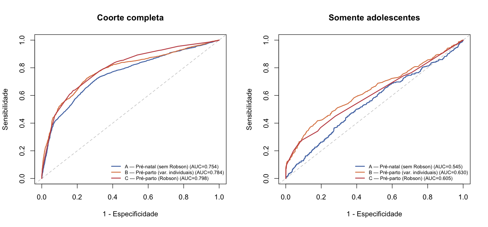
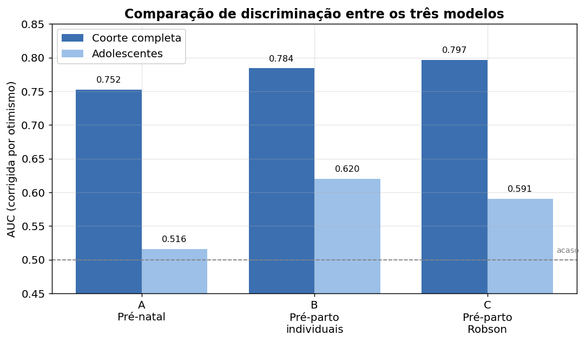
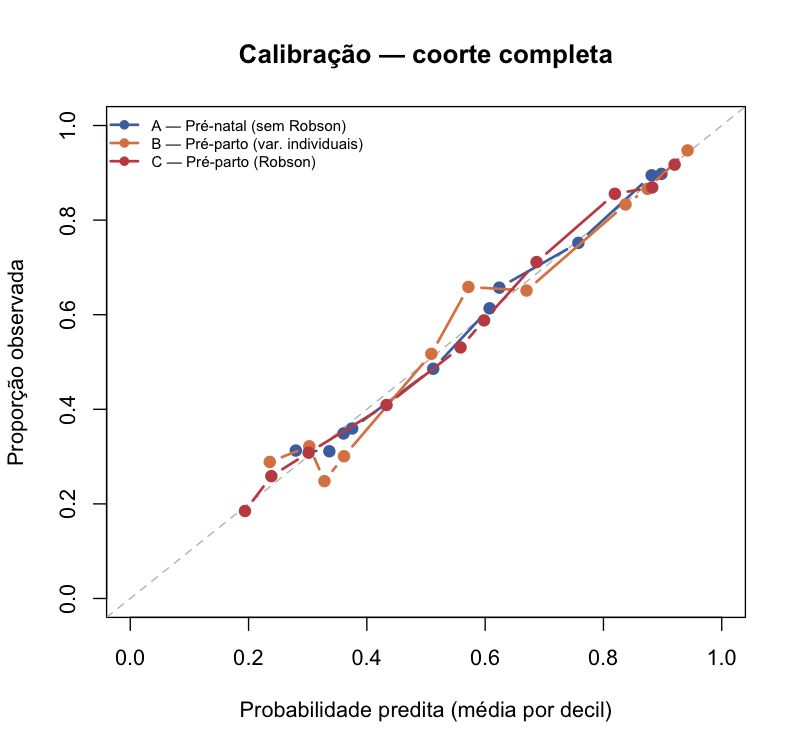
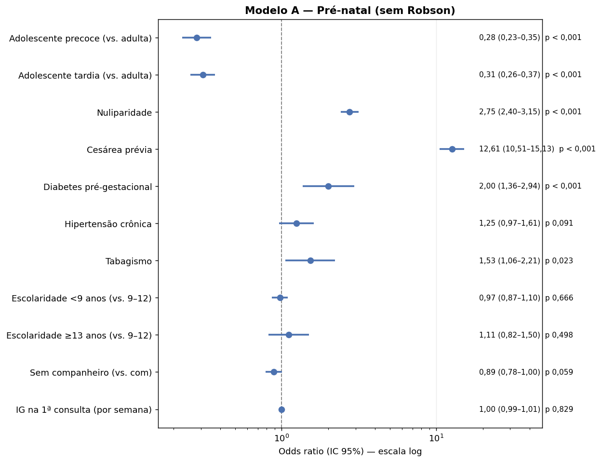
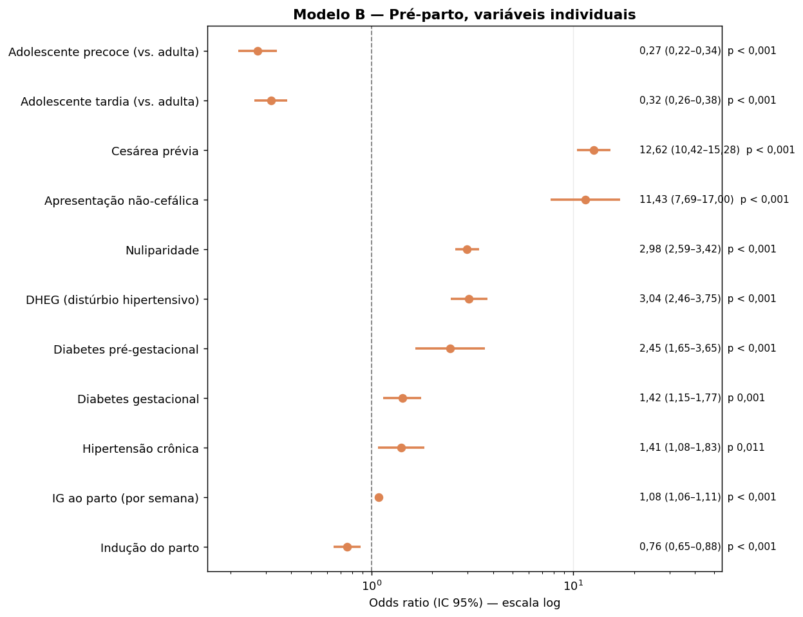
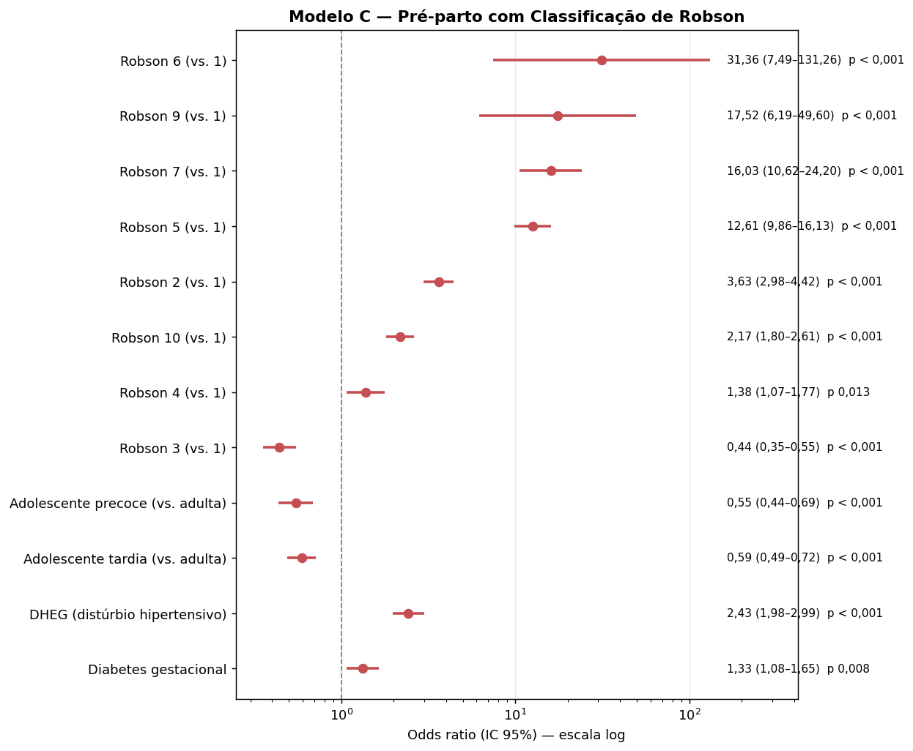

# Modelos preditivos de cesárea — Métodos e Resultados

**Estudo:** comparação entre gestantes adolescentes e adultas quanto ao parto cesárea
**Amostra:** coorte total de elegibilidade §3.3 — N = 6.650 (538 adolescentes precoces 11–15 anos, 829 adolescentes tardias 16–19 anos, 5.283 adultas 20–34 anos)
**Script:** `analysis/06_modelos_preditivos_cesarea.R`
**Data:** 10 de junho de 2026

> Este documento traz o texto de **Métodos** (pronto para inserção na dissertação) e os **Resultados** dos três modelos, com tabelas, figuras e interpretação. Os resultados aqui apresentados referem-se à **coorte total** (adolescentes + adultas), que apresentou o melhor desempenho preditivo. A análise de sensibilidade no subgrupo adolescente é resumida ao final (§4.4).

---

## 1. Métodos (texto para a dissertação)

### 1.1 Desfecho e estratégia de modelagem

O desfecho foi o **parto cesárea** (variável binária: cesárea *vs.* parto vaginal — normal ou fórcipe). Para predizer a cesárea foram construídos **três modelos de regressão logística** com finalidades clínicas distintas, definidos pelo momento em que as variáveis preditoras se tornam disponíveis ao longo da assistência:

- **Modelo A — pré-natal:** utiliza apenas informações disponíveis no início do pré-natal (sociodemográficas e antecedentes), respondendo à pergunta "qual o risco de esta gestante terminar a gestação em cesárea?". Não inclui a Classificação de Robson, que ainda não está definida nesse momento.
- **Modelo B — pré-parto, variáveis individuais:** acrescenta as variáveis obstétricas conhecidas ao final da gestação/admissão para o parto (apresentação fetal, idade gestacional ao parto, indução, distúrbios hipertensivos e diabetes), sem a Classificação de Robson.
- **Modelo C — pré-parto com Robson:** substitui os componentes que constituem a Classificação de Robson (paridade, cesárea prévia, apresentação, idade gestacional e início do trabalho de parto) pela **própria Classificação de Robson (grupos 1–10)**, evitando a colinearidade que decorreria de incluir simultaneamente Robson e seus componentes.

Essa estrutura permite responder a duas perguntas: (i) quais fatores predizem a cesárea desde o início da gestação e (ii) se a Classificação de Robson agrega valor preditivo quando a gestante chega ao parto.

### 1.2 Variáveis dos modelos

| Modelo | Preditoras |
|---|---|
| **A — pré-natal** | faixa etária; escolaridade; estado civil; nuliparidade; cesárea prévia; tabagismo; hipertensão arterial crônica; diabetes pré-gestacional; idade gestacional na primeira consulta |
| **B — pré-parto individual** | faixa etária; nuliparidade; cesárea prévia; apresentação não-cefálica; idade gestacional ao parto; indução do parto; DHEG; diabetes gestacional; hipertensão crônica; diabetes pré-gestacional |
| **C — pré-parto com Robson** | Classificação de Robson (1–10); faixa etária; DHEG; diabetes gestacional |

A **faixa etária** foi modelada em três categorias (adolescente precoce 11–15 anos; adolescente tardia 16–19 anos; adulta 20–34 anos), tendo as **adultas como categoria de referência**. A Classificação de Robson teve o **Grupo 1** como referência. Variáveis não incluídas e respectiva justificativa: índice de massa corporal inicial (74% ausente, imputação não confiável); pré-eclâmpsia isolada (apenas 15 casos, risco de separação — o componente hipertensivo é capturado pela variável DHEG); gestação múltipla (corresponde ao Grupo 8 de Robson, já excluído pelos critérios de elegibilidade); e renda/cobertura de saúde (não disponível na base).

### 1.3 Dados faltantes

Os dados faltantes nas variáveis preditoras (de 2% a 23% conforme a variável) foram tratados por **imputação múltipla por equações encadeadas** (*multiple imputation by chained equations*, MICE), gerando cinco bases imputadas. Os coeficientes foram combinados pelas **regras de Rubin**, e as medidas de desempenho foram calculadas em cada base imputada e promediadas. A imputação assegura que os três modelos sejam ajustados sobre o **mesmo número de observações (N = 6.650)**, condição necessária para a comparação justa da discriminação entre modelos não aninhados. O desfecho (cesárea), completo, foi incluído como preditor no modelo de imputação.

### 1.4 Avaliação de desempenho

O desempenho de cada modelo foi avaliado quanto à **discriminação**, pela área sob a curva ROC (AUC / estatística-c), e à **calibração**, por gráficos de probabilidade observada *versus* predita por decis. Reportou-se ainda o **escore de Brier** (erro quadrático médio das probabilidades preditas; menor é melhor) e o **R² de Nagelkerke**. Para reduzir o otimismo do ajuste, a AUC foi **corrigida por bootstrap** (200 reamostragens, método de Harrell). As análises foram conduzidas em R (pacotes `mice`, `pROC` e `rms`); a reprodução completa está em `analysis/06_modelos_preditivos_cesarea.R`.

---

## 2. Resultados — desempenho comparativo dos três modelos

Na coorte total, a capacidade de discriminação **aumentou progressivamente** do modelo pré-natal para o modelo pré-parto e atingiu o máximo com a Classificação de Robson (Tabela 1, Figuras 1 e 2). Os três modelos apresentaram **boa calibração**, com as probabilidades preditas próximas às proporções observadas ao longo de toda a faixa de risco (Figura 3).

**Tabela 1.** Desempenho preditivo dos três modelos (coorte total, N = 6.650).

| Modelo | AUC (corrigida) | Escore de Brier | R² de Nagelkerke |
|---|:--:|:--:|:--:|
| A — Pré-natal (sem Robson) | 0,752 | 0,196 | 0,265 |
| B — Pré-parto, variáveis individuais | 0,784 | 0,184 | 0,327 |
| C — Pré-parto com Robson | **0,797** | **0,181** | **0,338** |

*AUC = área sob a curva ROC (corrigida por otimismo via bootstrap). Brier e R² calculados sobre as cinco bases imputadas e promediados.*

O achado de maior interesse metodológico é que o **Modelo C, com apenas quatro termos** (Robson, faixa etária, DHEG e diabetes gestacional), alcançou desempenho **igual ou superior** ao Modelo B, que emprega um número bem maior de variáveis obstétricas individuais. Em outras palavras, a Classificação de Robson condensa em uma única variável a informação preditiva que, de outro modo, exigiria vários preditores isolados.

**Figura 1.** Curvas ROC dos três modelos (painel esquerdo: coorte total).

**Figura 2.** Comparação da AUC corrigida por otimismo entre os modelos.

**Figura 3.** Calibração dos três modelos na coorte total (probabilidade observada × predita, por decis).

---

## 3. Resultados — coeficientes de cada modelo

As tabelas a seguir apresentam as razões de chance (*odds ratio*, OR) ajustadas, com intervalo de confiança de 95% (IC 95%) e valor-p, combinadas pelas regras de Rubin. Cada modelo é ilustrado por um *forest plot*.

### 3.1 Modelo A — pré-natal

**Tabela 2.** Modelo A: preditores pré-natais de cesárea (coorte total).

| Variável | OR | IC 95% | p |
|---|:--:|:--:|:--:|
| Adolescente precoce (vs. adulta) | 0,28 | 0,23–0,35 | < 0,001 |
| Adolescente tardia (vs. adulta) | 0,31 | 0,26–0,37 | < 0,001 |
| Nuliparidade | 2,75 | 2,40–3,15 | < 0,001 |
| Cesárea prévia | 12,61 | 10,51–15,13 | < 0,001 |
| Diabetes pré-gestacional | 2,00 | 1,36–2,94 | < 0,001 |
| Tabagismo | 1,53 | 1,06–2,21 | 0,023 |
| Hipertensão crônica | 1,25 | 0,97–1,61 | 0,091 |
| Escolaridade < 9 anos (vs. 9–12) | 0,97 | 0,87–1,10 | 0,666 |
| Escolaridade ≥ 13 anos (vs. 9–12) | 1,11 | 0,82–1,50 | 0,498 |
| Sem companheiro (vs. com companheiro) | 0,89 | 0,78–1,00 | 0,059 |
| IG na 1ª consulta (por semana) | 1,00 | 0,99–1,01 | 0,829 |

**Figura 4.** Forest plot do Modelo A.

Mesmo usando apenas informações do início da gestação, o modelo discrimina razoavelmente (AUC 0,752). Os preditores dominantes são a **cesárea prévia** (OR 12,6) e a **nuliparidade** (OR 2,8). A **faixa etária adulta** já se associa a maior chance de cesárea: adolescentes precoces e tardias têm cerca de **70% menos chance** de cesárea que as adultas (OR ≈ 0,28–0,31), mesmo antes de qualquer ajuste obstétrico. Diabetes pré-gestacional e tabagismo aumentam o risco; escolaridade, estado civil e idade gestacional de início do pré-natal não foram preditores relevantes.

### 3.2 Modelo B — pré-parto, variáveis individuais

**Tabela 3.** Modelo B: preditores obstétricos individuais (coorte total).

| Variável | OR | IC 95% | p |
|---|:--:|:--:|:--:|
| Adolescente precoce (vs. adulta) | 0,27 | 0,22–0,34 | < 0,001 |
| Adolescente tardia (vs. adulta) | 0,32 | 0,26–0,38 | < 0,001 |
| Cesárea prévia | 12,62 | 10,42–15,28 | < 0,001 |
| Apresentação não-cefálica | 11,43 | 7,69–17,01 | < 0,001 |
| Nuliparidade | 2,98 | 2,59–3,42 | < 0,001 |
| DHEG (distúrbio hipertensivo) | 3,04 | 2,46–3,75 | < 0,001 |
| Diabetes pré-gestacional | 2,45 | 1,65–3,65 | < 0,001 |
| Diabetes gestacional | 1,42 | 1,15–1,77 | 0,001 |
| Hipertensão crônica | 1,41 | 1,08–1,83 | 0,011 |
| IG ao parto (por semana) | 1,08 | 1,06–1,11 | < 0,001 |
| Indução do parto | 0,76 | 0,65–0,88 | < 0,001 |

**Figura 5.** Forest plot do Modelo B.

Ao incorporar as variáveis do final da gestação, a discriminação sobe para AUC 0,784. **Cesárea prévia** (OR 12,6) e **apresentação não-cefálica** (OR 11,4) são os fatores mais fortes, seguidos de nuliparidade e dos distúrbios hipertensivos (DHEG, OR 3,0). Cada semana adicional de idade gestacional ao parto aumenta levemente a chance de cesárea (OR 1,08). A **indução do parto** associa-se a *menor* chance de cesárea (OR 0,76), coerente com o fato de que partos induzidos frequentemente evoluem para via vaginal, ao passo que a ausência de trabalho de parto inclui as cesáreas eletivas. O efeito protetor da adolescência mantém-se praticamente inalterado (OR ≈ 0,27–0,32).

### 3.3 Modelo C — pré-parto com Classificação de Robson

**Tabela 4.** Modelo C: Classificação de Robson e covariáveis (coorte total).

| Variável | OR | IC 95% | p |
|---|:--:|:--:|:--:|
| Robson 6 — nulípara pélvica (vs. 1) | 31,36 | 7,49–131,26 | < 0,001 |
| Robson 9 — situação transversa (vs. 1) | 17,52 | 6,19–49,60 | < 0,001 |
| Robson 7 — multípara pélvica (vs. 1) | 16,03 | 10,62–24,20 | < 0,001 |
| Robson 5 — multípara com cesárea prévia (vs. 1) | 12,61 | 9,86–16,13 | < 0,001 |
| Robson 2 — nulípara induzida/CS pré-TP (vs. 1) | 3,63 | 2,98–4,42 | < 0,001 |
| Robson 10 — pré-termo (vs. 1) | 2,17 | 1,80–2,61 | < 0,001 |
| Robson 4 — multípara induzida/CS pré-TP (vs. 1) | 1,38 | 1,07–1,77 | 0,013 |
| Robson 3 — multípara, espontânea (vs. 1) | 0,44 | 0,35–0,55 | < 0,001 |
| Adolescente precoce (vs. adulta) | 0,55 | 0,44–0,69 | < 0,001 |
| Adolescente tardia (vs. adulta) | 0,59 | 0,49–0,72 | < 0,001 |
| DHEG (distúrbio hipertensivo) | 2,43 | 1,98–2,99 | < 0,001 |
| Diabetes gestacional | 1,33 | 1,08–1,65 | 0,008 |

**Figura 6.** Forest plot do Modelo C.

Este foi o modelo de melhor desempenho (AUC 0,797). O gradiente de risco entre os grupos de Robson é coerente com a fisiopatologia obstétrica: as apresentações anômalas (Grupos 6, 7 e 9) e a multípara com cesárea prévia (Grupo 5) concentram as maiores chances de cesárea (OR de 12 a 31, relativos ao Grupo 1), enquanto a multípara em trabalho de parto espontâneo (Grupo 3) tem **menor** chance que a nulípara de referência (OR 0,44). É importante notar que, **mesmo após o ajuste pela Classificação de Robson, DHEG e diabetes gestacional, a faixa etária adulta permanece como fator de risco independente para cesárea** — adolescentes precoces e tardias mantêm OR ≈ 0,55–0,59 em relação às adultas. Ou seja, a maior taxa de cesárea entre as adultas não se explica integralmente pela diferente distribuição de grupos de Robson ou de comorbidades.

---

## 4. Síntese

### 4.1 Hierarquia de desempenho
Na coorte total, a discriminação cresceu de 0,752 (pré-natal) para 0,784 (pré-parto individual) e 0,797 (Robson), com calibração adequada em todos.

### 4.2 Robson agrega valor com parcimônia
O Modelo C igualou/superou o Modelo B usando muito menos variáveis — argumento metodológico favorável ao uso da Classificação de Robson como preditor sintético no momento do parto.

### 4.3 Efeito independente da idade
Em todos os três modelos, a idade adulta manteve-se como fator de risco independente para cesárea, reforçando o achado central da dissertação.

### 4.4 Nota sobre o subgrupo adolescente
Como análise de sensibilidade, os três modelos foram reajustados apenas nas adolescentes (n = 1.367). Nesse recorte o desempenho cai acentuadamente e a hierarquia se inverte (a Classificação de Robson perde poder discriminatório frente às variáveis individuais), porque 97,9% das adolescentes concentram-se em poucos grupos de Robson (1, 2, 3, 6 e 10) e nenhuma no Grupo 5. Os detalhes constam do relatório de viabilidade (`results/RELATORIO_MODELOS_PREDITIVOS_CESAREA.md`).

---

## 5. Arquivos

**Tabelas:** `results/tabelas_dissertacao/tab_modelos_preditivos_desempenho.csv`; `tab_modelo_A_pre_natal_OR.csv`; `tab_modelo_B_pre_parto_individual_OR.csv`; `tab_modelo_C_pre_parto_robson_OR.csv`

**Figuras:** `results/figures/fig_obj6_roc_modelos.png`; `fig_obj6_comparacao_auc.png`; `fig_obj6_calibracao.png`; `fig_obj6_forest_modelo_A.png`; `fig_obj6_forest_modelo_B.png`; `fig_obj6_forest_modelo_C.png`

**Script:** `analysis/06_modelos_preditivos_cesarea.R`
