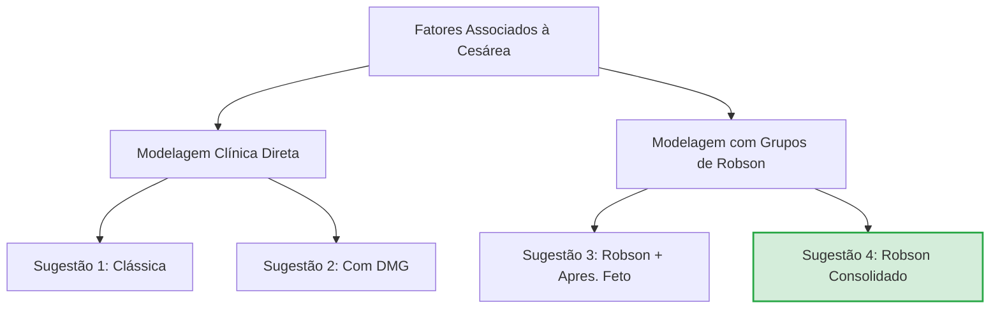

# Relatório de Análise Estatística: Resultados do SPSS
**Arquivo de Origem:** `analysis/Resultados_finais.ods`  
**Destinatária:** Letícia Schimidt Arruda (Dissertação de Mestrado)  
**Data da Análise:** 19 de Maio de 2026

Este relatório apresenta um resumo detalhado e interpretado das análises estatísticas realizadas e registradas nas abas **'descrição geral da base de dados'** e **'modelos sugeridos cesarea'** do arquivo de resultados do SPSS. 

---

## 📊 Resumo Executivo dos Achados

Os dados analisados refletem uma série histórica de 25 anos (1995-2017) do Hospital das Clínicas da FMUSP, comparando gestantes adolescentes (estratificadas em precoces de 11-15 anos e tardias de 16-19 anos) e gestantes adultas (estratificadas em 20-34 anos e 35 anos ou mais).

*   **Via de Parto e Idade:** Há uma associação altamente significativa ($p < 0,001$) entre a faixa etária e a via de parto. As adolescentes têm taxas de **cesárea drasticamente menores** (cerca de $30\%$) em comparação com as adultas ($62,3\%$ de 20-34 anos e $72,7\%$ de 35+ anos). No entanto, as adolescentes apresentam taxas de **parto instrumentalizado por fórcipe quase três vezes maiores** (cerca de $25-27\%$ contra $10,2\%$ nas adultas).
*   **Modelos de Regressão Logística para Cesárea:** A estatística propôs **4 modelos de regressão logística** para prever a probabilidade de parto cesárea. O modelo mais robusto e clinicamente relevante é a **Sugestão 4**, que controla pelos Grupos de Robson Reduzidos. Neste modelo, a **idade adulta é um fator de risco independente significativo** para a cesárea (OR = 1,79, $p = 0,015$).

---

## 🔎 Parte 1: Análise da Aba 'descrição geral da base de dados'

Esta aba contém tabelas de contingência (cruzamentos de variáveis qualitativas) com a faixa etária materna em 4 grupos: **11 a 15 anos**, **16 a 19 anos**, **20 a 34 anos** (referência adulta) e **35 anos e mais**. Para cada cruzamento, foi aplicado o teste **Qui-quadrado de Pearson** para avaliar a significância estatística da associação.

Abaixo, as variáveis foram categorizadas com base nos resultados e nos respectivos valores de p ($p$-value):

### 1. Perfil Sociodemográfico e Hábitos
*   **Cor/Raça (`cor_cat`):** **Não significativa ($p = 0,337$)**. A proporção de brancas ($59,9\%$) e não brancas ($40,1\%$) é homogênea entre os grupos etários.
*   **Estado Civil (`estado_civil_2`):** **Altamente significativa ($p < 0,001$)**. As adolescentes concentram-se majoritariamente em "solteira com companheiro" ($48,8\%$) ou "união estável" ($29,0\%$), enquanto as adultas apresentam maior taxa de casamento formal ($36,3\%$).
*   **Escolaridade (`escolaridade_cat`):** **Altamente significativa ($p < 0,001$)**. Mais da metade das adolescentes ($50,4\%$) tem menos de 9 anos de estudo (compatível com a idade escolar), enquanto nas adultas predomina 9 a 12 anos ($55,3\%$).
*   **Hábitos de Risco (`alcool`, `fumo`, `drogas`):** **Altamente significativas ($p < 0,001$)**. Curiosamente, o uso declarado de álcool ($5,3-5,4\%$), fumo ($7,6-13,2\%$) e drogas ($7,6-11,8\%$) é significativamente **maior entre as adolescentes** (especialmente na faixa de 16 a 19 anos) do que na população adulta geral do estudo.

### 2. Comorbidades Pré-Gestacionais e Patologias Maternas
*   **Patologias Gerais e Específicas:** A presença de comorbidades pré-existentes é significativamente **mais frequente no grupo de adultas e gestantes mais velhas (35+)** comparado às adolescentes:
    *   `patologia_materna` (geral): $3,4\%$ (11-15 anos) vs. $28,7\%$ (20-34 anos) vs. $40,0\%$ (35+ anos) ($p < 0,001$).
    *   Hipertensão Arterial Crônica Precoce (`hac_pre`): $0,4\%$ nas adolescentes vs. $7,4\%$ nas adultas e $15,6\%$ nas de 35+ ($p < 0,001$).
    *   Diabetes Pré-gestacional (`diabetes_pre`): $0,0\%$ nas adolescentes vs. $3,3\%$ nas adultas e $5,3\%$ nas de 35+ ($p < 0,001$).
    *   Também se mostraram altamente significativas ($p < 0,05$) com maior prevalência nas adultas: `dheg`, `asma_pre`, `cardiopatia_materna`, `epilepsia_pre` ($p = 0,004$), `trombofilias_pre` ($p = 0,009$) e `outras_patologias_pre`.
    *   **Não significativa:** Apenas a variável `iminencia_eclamp` (iminência de eclâmpsia pré-gestacional/admissão) não teve diferença estatística ($p = 0,231$).

### 3. Patologias e Intercorrências da Gestação Atual
*   **Diabetes Melito Gestacional (`dmg` e `dmg_obst`):** **Altamente significativa ($p < 0,001$)**. Muito mais frequente em adultas de 20-34 anos ($10,6\%$) e 35+ ($22,7\%$) do que em adolescentes ($0,5\%$).
*   **Distúrbios Hipertensivos da Gestação (`dheg_hipertensao_obst`):** **Altamente significativa ($p < 0,001$)**. Apresenta comportamento bimodal: $100\%$ das adolescentes de 11-15 anos e $96,7\%$ das de 16-19 anos analisadas nesta variável obstétrica registraram diagnóstico positivo, refletindo a alta vulnerabilidade das adolescentes a síndromes hipertensivas induzidas pela gravidez.
*   **Pré-eclâmpsia Obstétrica (`pe_obst`):** **Altamente significativa ($p < 0,001$)**. Apresenta altíssima concentração em adolescentes: $100\%$ no grupo 11-15 anos e $94,6\%$ no grupo 16-19 anos das que tiveram o registro.
*   **Eclâmpsia Obstétrica (`eclampsia_obst`):** **Altamente significativa ($p < 0,001$)**. Incidência de $33,3\%$ nas adolescentes de 16-19 anos contra apenas $1,8\%$ nas adultas e $1,1\%$ no grupo de 35+.
*   **Ruptura Prematura de Membranas Ovulares (`rpmo`):** **Altamente significativa ($p < 0,001$)**. Mais comum em adultas de 20-34 anos ($8,6\%$) e 35+ ($7,3\%$) do que em adolescentes de 11-15 ($0,2\%$) e 16-19 ($0,0\%$).
*   **Outras:** `itu` (infecção urinária geral - $p = 0,050$), `itu_obst` (não significativa, $p = 0,258$) e `anemia_obst` (não significativa, $p = 0,433$).

### 4. Características do Parto e Indicações
*   **Via de Parto (`tipo_parto`):** **Altamente significativa ($p < 0,001$)**.
    
    | Faixa Etária | Parto Normal (%) | Parto Fórcipe (%) | Cesárea (%) |
    | :--- | :---: | :---: | :---: |
    | **11 a 15 anos** | 45,4% | 24,5% | 30,1% |
    | **16 a 19 anos** | 41,2% | 27,3% | 31,4% |
    | **20 a 34 anos** | 27,5% | 10,2% | 62,3% |
    | **35 anos e mais** | 21,3% | 6,0% | 72,7% |
    | **Total Geral** | **29,0%** | **12,2%** | **58,8%** |

*   **Indicação Final de Parto Operatório (`ind_final`):** **Altamente significativa ($p < 0,001$)**. As indicações diferem drasticamente:
    *   **Nas adolescentes (11-15 anos):** As indicações mais frequentes são **Sofrimento fetal / Alteração de Vitalidade** ($34,8\%$) e **Desproporção Céfalo-Pélvica (DCP) / Fórcipe Falhado** ($27,5\%$).
    *   **Nas adultas (20-34 anos):** As indicações mais comuns são **Patologia Materna** ($15,4\%$), **Contraindicação de indução** ($10,9\%$) e **Iteratividade (Cesárea prévia repetida)** ($11,6\%$, que é inexistente ou residual nas adolescentes de 11-15 anos: $0\%$).
*   **Indução do Parto (`inducao_3`):** **Altamente significativa ($p < 0,001$)**. Taxa de indução de $18,1\%$ nas adultas de 20-34 anos contra apenas $6,5\%$ nas adolescentes de 11-15 anos.

### 5. Desfechos Neonatais e Fetais
*   **Prematuridade (`prematuro37` e `prematuro32`):** **Altamente significativas ($p < 0,001$)**. O nascimento pré-termo é mais prevalente no grupo de adultas:
    *   Pretermo < 37 semanas: $24,4\%$ (20-34 anos) and $25,3\%$ (35+ anos) vs. $10,4\%$ (11-15 anos) and $14,4\%$ (16-19 anos).
*   **Baixo Peso ao Nascer (`rnbp_2500g` e `rnbp_1500g`):** **Altamente significativas ($p < 0,001$)**. O peso inferior a 2500g acompanha a prematuridade, sendo maior nas adultas ($21,9\%$) e 35+ ($23,7\%$) do que nas adolescentes ($11,0\%$ a $12,8\%$).
*   **Apgar no 1º e 5º minuto menor que 7 (`apgar1_menor7` e `apgar5_menor7`):** **Significativas ($p < 0,05$)**. As taxas de Apgar baixo no 1º e 5º minutos são discretamente maiores nas adultas do que nas adolescentes. Apgar no 10º minuto não apresentou diferença estatística ($p = 0,068$).
*   **Óbito Fetal (`obito_fetal`):** **Significativa ($p = 0,011$)**. Taxas ligeiramente maiores de óbito fetal nas adultas ($2,5\%$) e 35+ ($3,1\%$) do que nas adolescentes ($1,3\%$).
*   **Malformação Fetal (`malform_fetal`):** **Significativa ($p < 0,001$)**. Mais frequente no grupo de adultas ($6,9\%$) e 35+ ($4,8\%$) do que nas adolescentes ($1,8-2,0\%$).

---

## 📈 Parte 2: Análise da Aba 'modelos sugeridos cesarea'

A estatística realizou modelagem por **Regressão Logística Múltipla** para estimar os fatores preditores independentes associados à ocorrência de parto cesárea (variável desfecho). Foram testados 4 modelos principais.

> [!NOTE]
> **Interação:** O arquivo traz a anotação expressa da estatística: *"Fiz análises de interação, mas não apresentaram melhoras."* Ou seja, termos de interação multiplicativos (ex: idade * DHEG) foram testados, mas não foram mantidos porque não melhoravam o ajuste estatístico global.

### 1. Análise Comparativa dos 4 Modelos Sugeridos

#### **Sugestão 1: Modelo Clínico Clássico**
*   **Variáveis Inseridas:** Faixa Etária (Adulta/Adolescente), Hipertensão Obstétrica (`dheg_hipertensao_obst`) e Apresentação Fetal (`apres_feto`).
*   **Ajuste do Modelo (Hosmer & Lemeshow):** Excelente ajuste ($\chi^2 = 0,314$; $df = 2$; **$p = 0,855$** - p-valor alto indica que não há diferença significativa entre os valores observados e previstos).
*   **Razões de Chance (Odds Ratios / Exp(B)):**
    *   **Faixa Etária Adulta vs. Adolescent:** **OR = 2,54** ($p = 0,001$; IC95%: 1,43 – 4,52). Ser gestante adulta multiplica a chance de cesárea por **2,54 vezes** em comparação com as adolescentes, de forma independente.
    *   **Hipertensão Obstétrica (DHEG):** **OR = 2,73** ($p < 0,001$; IC95%: 2,25 – 3,32). Ter DHEG aumenta a chance de cesárea em **2,73 vezes**.
    *   **Apresentação Fetal Anômala:** **OR = 9,22** ($p < 0,001$; IC95%: 5,81 – 14,62). Apresentação não-cefálica aumenta a chance de cesárea em **9,22 vezes**.

#### **Sugestão 2: Modelo Clínico com Diabetes (DMG)**
*   **Variáveis Inseridas:** Faixa Etária, Hipertensão Obstétrica, Apresentação Fetal e Diabetes Gestacional (`dmg_obst`).
*   **Ajuste do Modelo (Hosmer & Lemeshow):** Bom ajuste ($\chi^2 = 1,547$; $df = 3$; **$p = 0,672$**).
*   **Razões de Chance:**
    *   **Faixa Etária Adulta vs. Adolescent:** **Perdeu significância estatística ($p = 0,904$; OR = 1,19)**. Isso indica que a diferença simples de cesárea entre adultas e adolescentes nesses dados clínicos é explicada pela maior prevalência de Diabetes Gestacional (`dmg_obst`) no grupo das adultas.
    *   **Hipertensão Obstétrica (DHEG):** **OR = 2,72** ($p < 0,001$).
    *   **Apresentação Fetal Anômala:** **OR = 9,30** ($p < 0,001$).
    *   **Diabetes Gestacional (DMG):** **OR = 1,35** ($p = 0,007$; IC95%: 1,09 – 1,67). Ter diabetes na gestação aumenta a chance de cesárea em **$35\%$** de forma independente.

#### **Sugestão 3: Modelo de Robson com Sobrecarga de Variável**
*   **Variáveis Inseridas:** Faixa Etária, Hipertensão Obstétrica, Apresentação Fetal e Robson Reduzido.
*   **Crítica Técnica:** Este modelo tem um problema de multicolinearidade. A variável "Apresentação Fetal" já é um dos critérios de categorização dos Grupos de Robson (ex: Grupos 6, 7 e 9 são definidos pela apresentação pélvica ou anômala). A sua inclusão simultânea distorce os coeficientes. A estatística provavelmente percebeu isso e gerou a Sugestão 4.

#### **Sugestão 4: Modelo Consolidado com Grupos de Robson (Recomendado)**
Este é o **modelo definitivo e mais completo**, pois ajusta o risco da cesárea pelas indicações obstétricas estruturadas pela classificação de Robson, sem redundâncias.
*   **Variáveis Inseridas:** Faixa Etária (`faixa_etaria_2cat`), Hipertensão Obstétrica (`dheg_hipertensao_obst`) e Robson Reduzido (`Robson_reduzido`).
*   **Ajuste do Modelo (Hosmer & Lemeshow):** Excelente ajuste ($\chi^2 = 5,215$; $df = 6$; **$p = 0,517$**).
*   **Razões de Chance (Odds Ratios / Exp(B)):**

| Variável | Coeficiente (B) | Valor de p | Odds Ratio (Exp(B)) | IC 95% para Exp(B) |
| :--- | :---: | :---: | :---: | :---: |
| **Faixa Etária Adulta (vs. Adolescente)** | **0,581** | **0,015** | **1,79** | **[1,12 – 2,86]** |
| **DHEG / Hipertensão (Sim)** | **-0,914** | **< 0,001** | **0,40** | **[0,32 – 0,50]** |
| **Grupo de Robson 2** (Nulípara, induzida/cesárea pré-parto) | 1,478 | < 0,001 | **4,38** | [3,30 – 5,82] |
| **Grupo de Robson 3** (Multípara, espontânea) | -0,727 | < 0,001 | **0,48** | [0,35 – 0,66] |
| **Grupo de Robson 4** (Multípara, induzida/cesárea pré-parto) | 0,620 | < 0,001 | **1,86** | [1,33 – 2,59] |
| **Grupo de Robson 5** (Multípara com cesárea prévia) | 2,613 | < 0,001 | **13,65** | [9,88 – 18,85] |
| **Grupo de Robson 6** (Nulípara pélvica) | 3,163 | < 0,001 | **23,65** | [5,49 – 101,89] |
| **Grupo de Robson 7** (Multípara pélvica) | 3,130 | < 0,001 | **22,86** | [13,05 – 40,08] |
| **Grupo de Robson 9** (Apresentação anômala/transversa) | 3,320 | < 0,001 | **27,66** | [6,49 – 117,89] |
| **Grupo de Robson 10** (Pré-termo) | 0,988 | < 0,001 | **2,69** | [2,05 – 3,52] |
| **Constante** | -0,384 | 0,073 | 0,68 | - |

> [!IMPORTANT]
> **Interpretação do Efeito da DHEG no Modelo 4:**  
> Curiosamente, no Modelo 4, o coeficiente da DHEG é negativo ($B = -0,914$), gerando um Odds Ratio protetor de **0,40** (redução de $60\%$ na chance de cesárea). Clinicamente, isso ocorre porque o modelo está *controlando* pelos Grupos de Robson. Gestações com DHEG frequentemente entram nos grupos de indução de parto (Robson 2, 4 e 10). Assim, uma vez ajustado pelo grupo de Robson em que a paciente foi alocada, a presença isolada de hipertensão não aumenta o risco intrínseco de falha e cesárea; ao contrário, está associada a taxas de sucesso de parto vaginal maiores do que os partos cirúrgicos diretos sem tentativa de indução.

> [!TIP]
> **Referência dos Grupos de Robson:**  
> O grupo de referência omitido (baseline de comparação) para a variável `Robson_reduzido` é o **Grupo de Robson 1** (Nulípara, gestação única, cefálica, $\ge 37$ semanas, em trabalho de parto espontâneo). Portanto, os Odds Ratios de cada grupo são comparados diretamente com o Grupo 1. Por exemplo:
> *   Uma multípara com cesárea prévia (Grupo 5) tem **13,65 vezes mais chance** de cesárea do que uma nulípara em trabalho de parto espontâneo (Grupo 1).
> *   Uma multípara em trabalho de parto espontâneo (Grupo 3) tem **metade da chance (OR = 0,48)** de cesárea do que a nulípara espontânea (Grupo 1), o que é um fator protetor clássico na obstetrícia.

---

## 💡 Implicações Clínicas e Científicas para a Dissertação

Estes resultados estatísticos fornecem elementos extremamente ricos para a discussão do seu manuscrito (`dissertacao.qmd`):

1.  **O Paradoxo do Fórcipe vs. Cesárea nas Adolescentes:** Embora as adolescentes tenham menor probabilidade de cesárea, elas são submetidas a uma taxa de fórcipe de $30\%$, três vezes maior que as adultas ($10,2\%$). Isso dialoga diretamente com a literatura sobre **imaturidade pélvica** e o uso mais frequente de analgesia de parto que pode prolongar o período expulsivo em adolescentes precoces, exigindo a extração instrumentalizada.
2.  **O Papel da Idade como Risco Independente:** O fato de a faixa etária adulta manter-se associada de forma independente a um risco $79\%$ maior de cesárea (OR = 1,79 no Modelo 4), mesmo após controlar pela classificação de Robson e pela presença de hipertensão, sugere que pode haver uma **diferença no padrão de intervenção médica** (maior tolerância ao tempo de trabalho de parto em adolescentes ou maior "pressão" assistencial por cesárea em adultas).
3.  **Comorbidades:** O Modelo 2 demonstra com elegância que o diabetes gestacional (DMG) é o fator que "consome" a significância da idade no modelo puramente clínico, evidenciando que o aumento de cesáreas em adultas sem o ajuste de Robson está intimamente ligado a comorbidades metabólicas adquiridas com a idade.
